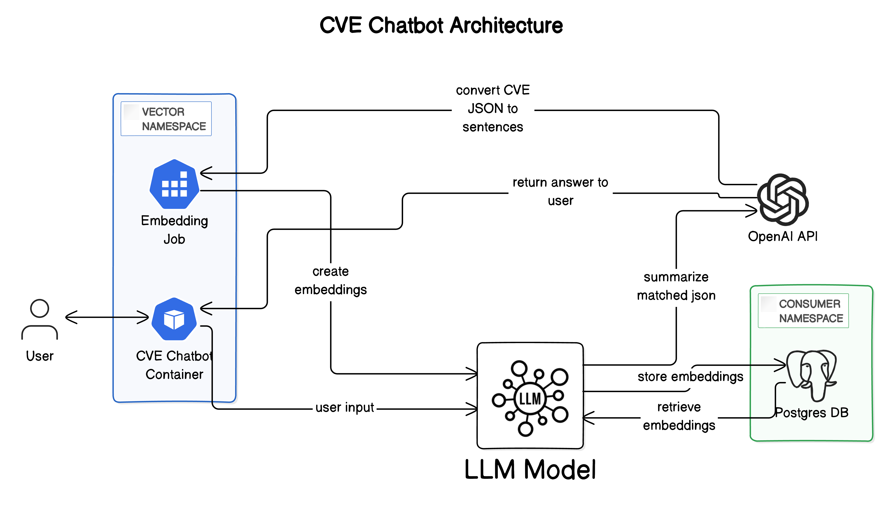

## Robust and Highly Available Architecture for CVE Data Chatbot

This project deploys a Chatbot using Retrieval-Augmented Generation (RAG) to answer questions about the latest Common Vulnerabilities and Exposures (CVE) data. Below is a detailed explanation of the architecture and its key components.

### Architecture Overview

### Key Components

1. **Custom Kubernetes Operator**
    - Monitors for new CVE releases.
    - Pushes data via the processor to the Kafka cluster.

2. **Kafka Cluster**
    - Receives data from the custom operator.
    - Ensures high availability and fault tolerance.

3. **Consumer Application**
    - Processes received messages.
    - Stores data in the PostgreSQL database.

4. **Embeddings Job**
    - Creates embeddings for CVE data.
    - Stores embeddings in the PostgreSQL database.

5. **Language Model Chatbot (LLM)**
    - Uses embeddings to generate answers to user questions.

### Example Questions

- "I am using GitLab. Which vulnerability does GitLab have? How can I mitigate it?"
- "Which CVE affected GlobalProtect App by Palo Alto Networks? Describe in detail."
- "What is the CVE for the vulnerability in the Apache HTTP Server 2.4.46 and how can I mitigate it?"

### Architecture Features

- **Microservices Architecture**: Each service is deployed as a separate container in the Kubernetes cluster.
- **Availability**: Anti-Affinity rules ensure pods are not scheduled on the same node.
- **Scalability**: Horizontal Pod Autoscaler scales components based on CPU and memory usage. Pod Disruption Budget (PDB) ensures minimal disruption during scaling.
- **Monitoring**: Prometheus and Grafana are bootstrapped with the EKS cluster to collect and visualize metrics. Custom dashboards in Grafana monitor services.
- **Logging**: FluentD collects logs from multiple services and forwards them to CloudWatch.
- **Security**: IAM Roles follow the Least Privilege Principle. AWS EKS is used with private subnets and the AWS CNI plugin. External services are exposed using Istio Ingress Gateway with a valid SSL certificate.
- **Service Mesh**: Istio in a sidecar configuration manages traffic between services. Istio Gateway exposes services to the outside world.
- **SSL Certificates**: Cert-manager manages SSL certificates for services, automatically renewing them without manual intervention.

## Repository Structure

# https://github.com/cve-chatbot-k8s/ami-jenkins

- **ami-jenkins**: Contains the Jenkins pipeline code to build the AMI for the Jenkins server.
- The AMI contains Jenkins jobs baked into the image making it easier to deploy Jenkins.
- The AMI is built using packer

# https://github.com/cve-chatbot-k8s/infra-jenkins

- **infra-jenkins**: Contains the Terraform code to deploy the Jenkins server on AWS.

# https://github.com/cve-chatbot-k8s/webapp-cve-processor

- **webapp-cve-processor**: Contains the code for the web application that processes the CVE data.
- CVE-processor is written in Go and uses Sarama to connect and send messages to the Kafka cluster.
- We are using a Async Kafka Producer and used Goroutines to send messages to the Kafka cluster.
- This resulted in the processor being able to process 250000 messages in under 2 minute.

# https://github.com/cve-chatbot-k8s/webapp-cve-consumer
- **webapp-cve-consumer**: Contains the code for the web application that consumes the CVE data.
- CVE-consumer is written in Go and uses Sarama to connect and consume messages from the Kafka cluster.
- Consumer consumes messages from Kafka and stores them in the Postgres Database.

# https://github.com/cve-chatbot-k8s/cve-operator
- **cve-operator**: Contains the code for the Kubernetes operator that manages the lifecycle of the CVE processor.
- The operator creates two CRD's (Custom Resource Definitions) GithubReleaseMonitor and GitHubRelease. 
- The GithubReleaseMonitor watches for new CVE releases and creates a GitHubRelease CRD for each CVE delta file.
- The GitHubRelease runs the webapp-cve-processor as a Job in order to process new CVE data. Thus keeping the CVE data up to date.

# https://github.com/cve-chatbot-k8s/vector
- **vector**: Contains code for 2 services Search Embeddings, and Store Embeddings.
- Store Embeddings creates embeddings using HuggingFace Transformers and stores them in the Postgres Database.
- We are using PGVECTOR to store the embeddings in the Postgres Database.
- Search Embeddings uses the embeddings to search for similar CVE's based on the embeddings. And contains the code for the StreamLit web application.

# https://github.com/cve-chatbot-k8s/infra-aws
- **infra-aws**: Contains the Terraform code to deploy a EKS cluster.
- The EKS cluster is bootstrapped with Kafka, Prometheus, Grafana, ExternalDNS, Cert-Manager

# https://github.com/cve-chatbot-k8s/helm-webapp-cve-processor
- **helm-webapp-cve-processor**: Contains the Helm chart to deploy the webapp-cve-processor on the EKS cluster.
- The Helm chart deploys the webapp-cve-processor as a Kubernetes Job

# https://github.com/cve-chatbot-k8s/helm-webapp-cve-consumer
- **helm-webapp-cve-consumer**: Contains the Helm chart to deploy the webapp-cve-consumer on the EKS cluster.
- The CVE-consumer is deployed as a Kubernetes Deployment with 3 replicas for high availability.
- The CVE-consumer has a init container that runs migrations on the Postgres Database.
- This Helm chart also deploys the Postgres Database as a StatefulSet.

# https://github.com/cve-chatbot-k8s/helm-eks-autoscaler
- **helm-eks-autoscaler**: Contains the Helm chart to deploy the EKS Autoscaler on the EKS cluster.

# https://github.com/cve-chatbot-k8s/helm-vector
- **helm-vector**: Contains the 2 Helm charts to deploy the Create Embeddings as a Kubernetes Job and Search Embeddings as a Kubernetes Deployment on the EKS cluster.

