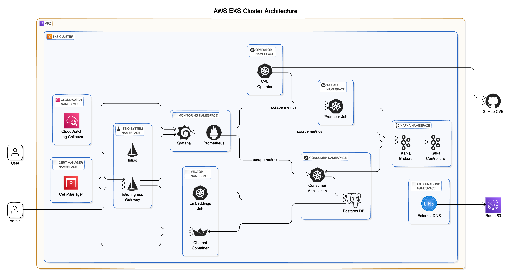

## Project: RAG On Custom CVE Data Deployed on Kubernetes

### Kubernetes Architecture

This project aims to build a RAG (Retrieval-Augmented Generation) system around the latest CVE (Common Vulnerabilities and Exposures) data. Below is the detailed architecture of the project deployed on an AWS EKS cluster.

### Architecture Explanation

This is a Robust and Highly Available architecture to deploy a Chatbot that uses RAG (Retrieval-Augmented Generation) to answer questions about the latest CVE (Common Vulnerabilities and Exposures) data.
We created a custom kubernetes operator to monitor for new CVE releases and push the data via the processor to the kafka cluster
The consumer then processes the received messages and stores them in the Postgres Database.
Another kubernetes Job is created to create embeddings for the CVE data in the same Postgres Database.
These embeddings are used when the user asks a question about the CVE data. We managed to train the LLM (Language Model) on the embeddings to generate answers to the questions asked by the user.
The kind of questions that can be asked are:
- I am using gitlab which vulnerability does gitlab have? And how can I mitigate it?
- Which CVE affected GlobalProtect App by Palo Alto Networks Describe in detail
- What is the CVE for the vulnerability in the Apache HTTP Server 2.4.46 and how can I mitigate it?

This project also features Robust Monitoring and is created for being Highly Available and Scalable. Here are some key aspects of the architecture:

- Microservices Architecture: The project is built using a microservices architecture. Each service is deployed as a separate container in the Kubernetes cluster.
- Availability: Used Anti-Affinity rules to ensure that the pods are not scheduled on the same node for all components.
- Scalability: Each Kubernetes component using Horizontal Pod Autoscaler to scale based on the CPU and Memory usage. We have configured PDB (Pod Disruption Budget) to ensure that the pods are not disrupted during scaling.
- Monitoring: Prometheus and Grafana is bootstrapped with the EKS cluster to get metrics from the Kubernetes cluster. We also created custom dashboards in Grafana to monitor the services.
- Logging: We are using FluentD to collect all the logs from multiple services and forward them to CloudWatch.
- Security: IAM Roles are created using the Least Privilege Principle. We are using AWS EKS with private subnets and the EKS cluster is bootstrapped with the AWS CNI plugin. All external services are exposed using istio ingress gateway with a valid SSL certificate.
- Service Mesh: We are using Istio in a sidecar configuration to manage the traffic between the services. We have configured the Istio Gateway to expose the services to the outside world.
- SSL Certificates: We are using cert-manager to manage the SSL certificates for the services. We have configured the cert-manager to automatically renew the certificates. Thus there is no manual intervention required to renew the certificates.

## Repository Structure

# https://github.com/cve-chatbot-k8s/ami-jenkins

- **ami-jenkins**: Contains the Jenkins pipeline code to build the AMI for the Jenkins server.
- The AMI contains Jenkins jobs baked into the image making it easier to deploy Jenkins.
- The AMI is built using packer

# https://github.com/cve-chatbot-k8s/infra-jenkins

- **infra-jenkins**: Contains the Terraform code to deploy the Jenkins server on AWS.

# https://github.com/cve-chatbot-k8s/webapp-cve-processor

- **webapp-cve-processor**: Contains the code for the web application that processes the CVE data.
- CVE-processor is written in Go and uses Sarama to connect and send messages to the Kafka cluster.
- We are using a Async Kafka Producer and used Goroutines to send messages to the Kafka cluster.
- This resulted in the processor being able to process 250000 messages in under 2 minute.

# https://github.com/cve-chatbot-k8s/webapp-cve-consumer
- **webapp-cve-consumer**: Contains the code for the web application that consumes the CVE data.
- CVE-consumer is written in Go and uses Sarama to connect and consume messages from the Kafka cluster.
- Consumer consumes messages from Kafka and stores them in the Postgres Database.

# https://github.com/cve-chatbot-k8s/cve-operator
- **cve-operator**: Contains the code for the Kubernetes operator that manages the lifecycle of the CVE processor.
- The operator creates two CRD's (Custom Resource Definitions) GithubReleaseMonitor and GitHubRelease. 
- The GithubReleaseMonitor watches for new CVE releases and creates a GitHubRelease CRD for each CVE delta file.
- The GitHubRelease runs the webapp-cve-processor as a Job in order to process new CVE data. Thus keeping the CVE data up to date.

# https://github.com/cve-chatbot-k8s/vector
- **vector**: Contains code for 2 services Search Embeddings, and Store Embeddings.
- Store Embeddings creates embeddings using HuggingFace Transformers and stores them in the Postgres Database.
- We are using PGVECTOR to store the embeddings in the Postgres Database.
- Search Embeddings uses the embeddings to search for similar CVE's based on the embeddings. And contains the code for the StreamLit web application.

# https://github.com/cve-chatbot-k8s/infra-aws
- **infra-aws**: Contains the Terraform code to deploy a EKS cluster.
- The EKS cluster is bootstrapped with Kafka, Prometheus, Grafana, ExternalDNS, Cert-Manager

# https://github.com/cve-chatbot-k8s/helm-webapp-cve-processor
- **helm-webapp-cve-processor**: Contains the Helm chart to deploy the webapp-cve-processor on the EKS cluster.
- The Helm chart deploys the webapp-cve-processor as a Kubernetes Job

# https://github.com/cve-chatbot-k8s/helm-webapp-cve-consumer
- **helm-webapp-cve-consumer**: Contains the Helm chart to deploy the webapp-cve-consumer on the EKS cluster.
- The CVE-consumer is deployed as a Kubernetes Deployment with 3 replicas for high availability.
- The CVE-consumer has a init container that runs migrations on the Postgres Database.
- This Helm chart also deploys the Postgres Database as a StatefulSet.

# https://github.com/cve-chatbot-k8s/helm-eks-autoscaler
- **helm-eks-autoscaler**: Contains the Helm chart to deploy the EKS Autoscaler on the EKS cluster.

# https://github.com/cve-chatbot-k8s/helm-vector
- **helm-vector**: Contains the 2 Helm charts to deploy the Create Embeddings as a Kubernetes Job and Search Embeddings as a Kubernetes Deployment on the EKS cluster.

